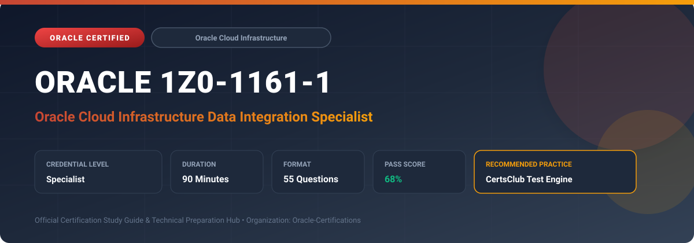

  

# Oracle 1Z0-1161-1: Oracle Cloud Infrastructure Data Integration Specialist

---

## 1. Exam Overview & Candidate Profile

The **Oracle 1Z0-1161-1: Oracle Cloud Infrastructure Data Integration Specialist** credential certifies professionals who demonstrate technical mastery, architectural competence, and hands-on operational capability in this certification domain.

Candidates validate comprehensive knowledge and expertise required to design, configure, manage, and optimize mission-critical Oracle environments across cloud, on-premises, and hybrid architectures.

### Target Audience & Prerequisites
- **Target Roles**: Implementation Specialists, Cloud Architects, Technical Leads, Enterprise Consultants, and Systems Engineers.
- **Recommended Experience**: 1–2 years of practical, hands-on experience designing, implementing, and maintaining corresponding Oracle solutions.
- **Credential Earned**: Specialist Certification.

---

## 2. Key Exam Specifications

| Specification | Details |
| :--- | :--- |
| **Exam Code** | **Oracle 1Z0-1161-1** |
| **Official Title** | Oracle Cloud Infrastructure Data Integration Specialist |
| **Certification Track** | Oracle Cloud Infrastructure |
| **Exam Duration** | 90 Minutes |
| **Number of Questions** | 55 Questions |
| **Passing Score** | 68% |
| **Question Format** | Multiple Choice (Single/Multiple Answer), Scenario-Based Questions |
| **Delivery Provider** | Oracle University / Pearson VUE (Online Proctored or Test Center) |
| **Recommended Practice Engine** | [CertsClub Oracle Practice Tests](https://www.certsclub.com/oracle/1z0-1161-1-dumps.html) |

---

## 3. Official Blueprint & Exam Domain Breakdown

The examination assesses candidate competencies across core functional domains weighted as follows:

| Domain Area | Weighting |
| :--- | :--- |
| **OCI Data Integration Architecture & Workspaces** | `25%` |
| **Data Assets, Connections & Schema Discovery** | `25%` |
| **Building Data Flows, Mappings & Tasks** | `20%` |
| **Pipeline Orchestration & Task Scheduling** | `15%` |
| **Private Endpoints, Security & Monitoring** | `15%` |

---

## 4. Deep Dive into Complex & Challenging Technical Topics

To secure a passing score on the 1Z0-1161-1 exam, candidates must master the following advanced concepts:

- Configuring OCI Data Integration Workspaces, Projects, and Folders to organize data engineering artifacts.
- Creating Data Assets and secure Connections across Oracle databases, Object Storage, Amazon S3, and on-premises sources via Private Endpoints.
- Designing complex Data Flows with operators: Source, Target, Join, Filter, Aggregate, Lookup, Union, and Expression transforms.
- Orchestrating multi-step execution workflows using Pipelines, branching conditions, loops, and parallel stages.
- Monitoring task execution, handling runtime errors, profiling data schemas, and viewing detailed operator logs.

---

## 5. Scenario-Based Demo & Practice Questions

### Question 1
In OCI Data Integration, which entity encapsulates connection details, driver configurations, and network endpoints required to extract or load data to an external database or object store?

A) Data Asset
B) Bucket Marker
C) FastConnect Circuit
D) Cloud Guard Detector

- **Correct Answer**: `A) Data Asset`  
- **Technical Explanation**: A Data Asset in OCI Data Integration represents an external data source or target system (e.g., Autonomous Database, Oracle DB, Object Storage, AWS S3), encapsulating its schema definitions and connection parameters.

---

### Question 2
To connect OCI Data Integration to an on-premises Oracle database without public IP exposure, which networking construct must be associated with the Data Integration workspace?

A) Private Network Endpoint inside a VCN Subnet
B) Public Internet Gateway
C) NAT Gateway with open ingress
D) Public Load Balancer

- **Correct Answer**: `A) Private Network Endpoint inside a VCN Subnet`  
- **Technical Explanation**: Configuring a Private Endpoint within a private VCN subnet enables OCI Data Integration to establish secure, private network connectivity over IPSec VPN or FastConnect to on-premises resources.

---

## 6. Recommended Preparation Strategy & Practice Testing Engine

Achieving certification in **Oracle 1Z0-1161-1** requires balanced theoretical study and scenario-based simulation practice:

1. **Review Oracle Documentation**: Master architecture guides, implementation workbooks, and administration manuals on the Oracle Help Center.
2. **Hands-on Lab Practice**: Execute real-world configuration, policy setup, and troubleshooting tasks in your cloud tenancy or test instance.
3. **Simulated Exam Drills**: Practice answering timed, scenario-based multiple-choice questions to familiarize yourself with the question formats, traps, and timing constraints.

### Practice With CertsClub
For realistic practice questions, updated dumps, and mock testing environments:
- **Resource**: [CertsClub Oracle Practice Test Engine](https://www.certsclub.com/oracle/1z0-1161-1-dumps.html)
- **Special Discount**: Use coupon code **`club20`** during checkout for an instant **20% discount** on all practice exam bundles and testing engines.

---

## 7. Official Documentation & References

- [Oracle University Certification Registry](https://education.oracle.com/)
- [Oracle Help Center Documentation Portal](https://docs.oracle.com/)
- [Oracle Cloud Infrastructure & Applications Guides](https://docs.oracle.com/en/cloud/)
- [CertsClub Oracle Certification Exam Practice](https://www.certsclub.com/oracle/1z0-1161-1-dumps.html)

---

## 8. SEO & Discovery Keywords

`oracle 1z0-1161-1, oracle 1z0-1161-1 exam, oracle 1z0-1161-1 dumps, 1Z0-1161-1 practice questions, 1Z0-1161-1 study guide, oci data integration specialist, certsclub 1z0-1161-1`